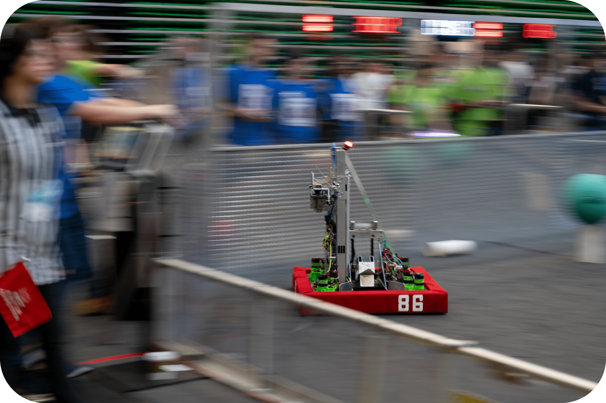

# Welcome to the Team Resistance GitHub!

[Team Resistance](https://www.teamresistance.org/) is a veteran team that competes in the [FIRST Robotics Competition](https://www.firstinspires.org/robotics/frc). You can find all of our code from now to 2014 here!

Team Resistance is based in Jacksonville, Florida, and we are one of the few organizations in the North Florida area providing highly valuable education and skills that our students can take far beyond FIRST - we teach students passionate about STEM career and life skills using hands-on robotics, engineering, programming, and design challenges through the FIRST Robotics Competition.

*Going against the current since 1996!*!

